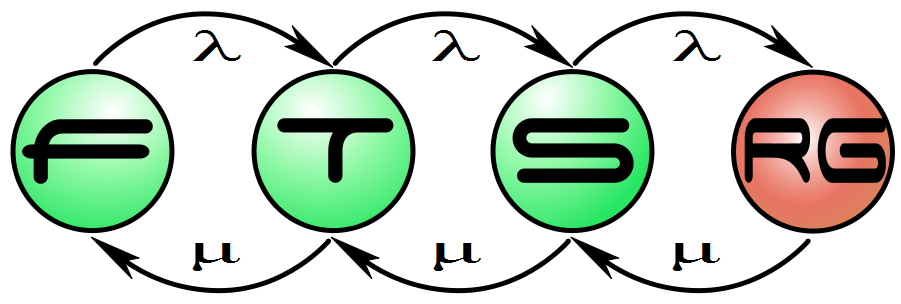

# ftsrg logo

## Original logo (~1996)

The first logo of the research group represented its original name and focus, modeling and analysis of fault-tolerant computer systems (e.g., [this paper](https://pp.bme.hu/ee/article/view/4424)).

Arrows with &lambda; represent faults, while arrows with &mu; represent repairs. Green circles represent healthy states, while red circles represent failure states.

György Csertán created the logo.

## Redrawn logo (~2010)

The logo of the research group was redrawn around 2010 to support up-to-date formats, while keeping its original message.

# Redesigned logo (~2019)

While preparing for the 25th anniversary of the research group, we set out to create a new, modern logo that is visually more streamlined but retains some hints of the group's research activities.

After several iterations, we selected a logo with small capitalization. The three dots in the logo still represent fault-tolerant behavior, e.g., failure, recovery, and healthy states of a system.

Nóra Lengyel designed the new logo.

In 2021, we changed our name to Critical Systems Research Group, but kept our original, beloved acronym, ftsrg, and the new logo.

